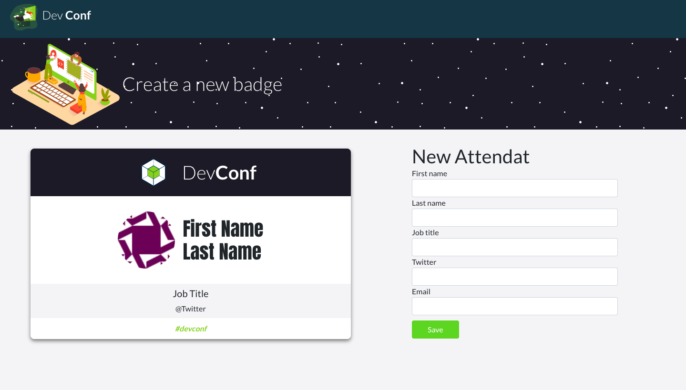
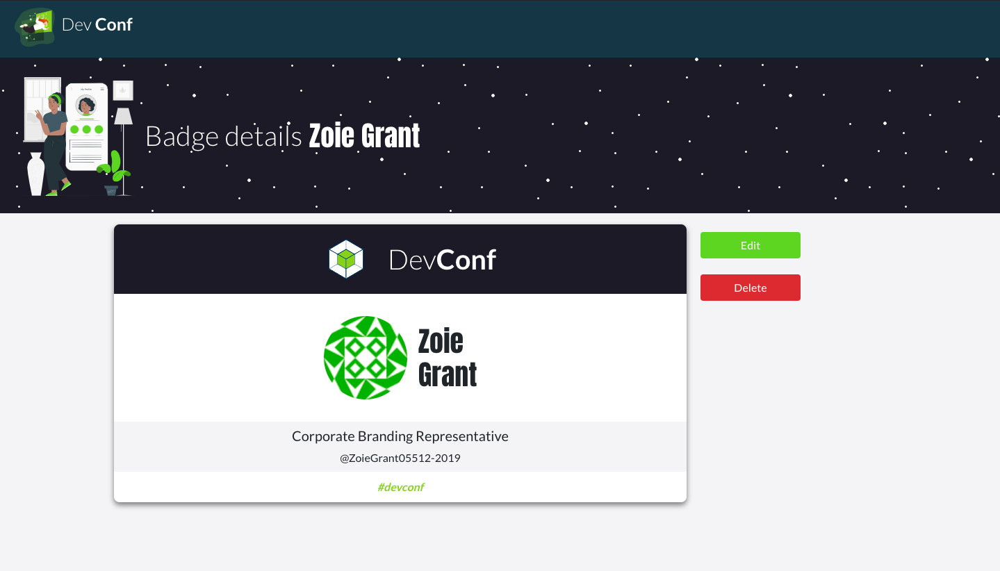
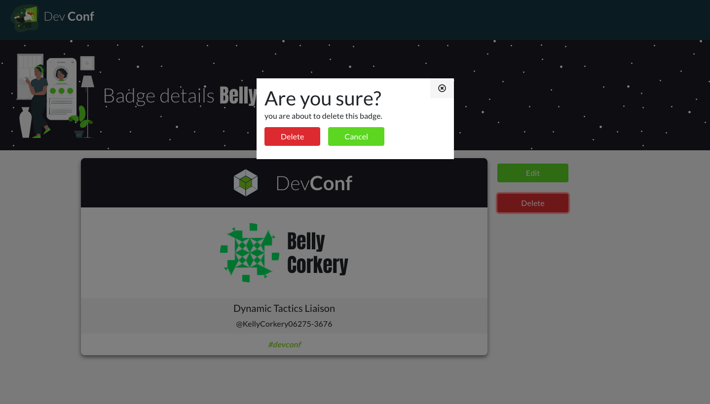
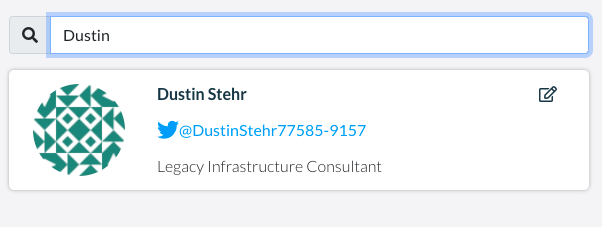
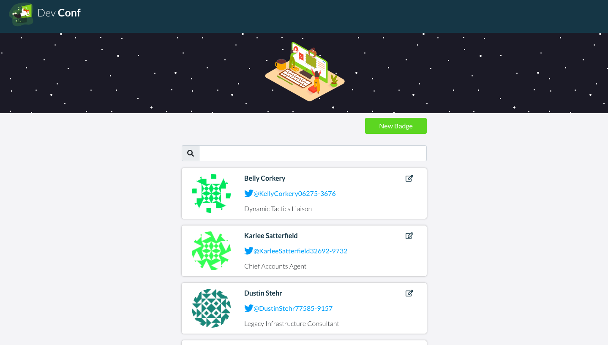

# Badges System

CRUD System Badges management for a developers conference

## Features

- Create badges with the personal information

- Edit badges previously created (obviously)

- Delete badges

- Search and Filter the badge list

## Other Screenshots

### Home page

### Badge list page

### Edit Badge page

### New Badge page

## Technologies

- ReactJS
- React Router DOM
- Fake API
- Gravatar 

**from**: 🇨🇴  
**by**: Andrés Núñez  
**Made with**: 💛
